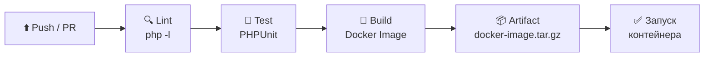
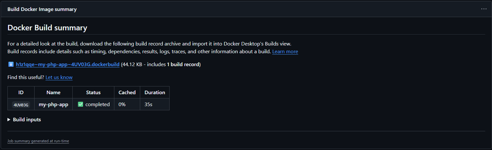
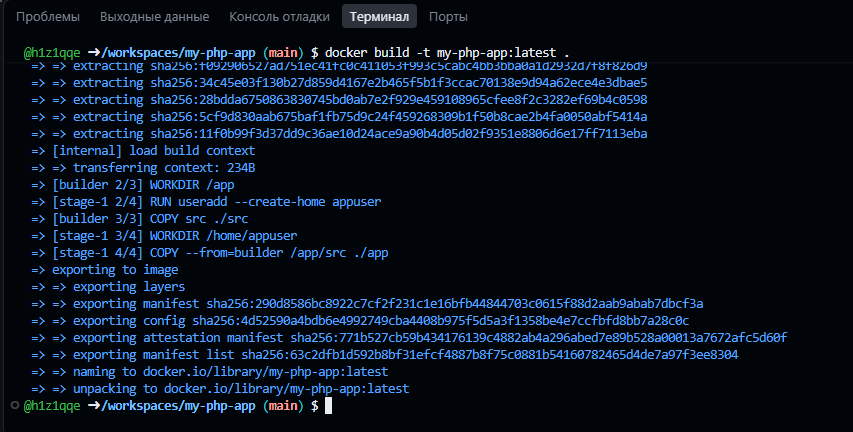
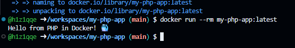

# 🚀 PHP CI Pipeline

### Учебный проект: контейнеризация PHP-приложения и непрерывная интеграция с GitHub Actions


**Цель** — простой учебный проект, который можно склонировать, настроить и убедиться на практике,
что приложение в контейнере на **PHP** и пайплайн **GitHub Actions** работают вместе! 🎯


---

## 📖 О проекте

### 🎓 Чему вы научитесь

| | Навык |
|:---:|:---|
| 🔄 | Настраивать **CI** для **PHP**-проектов |
| 🐳 | Контейнеризировать приложения с помощью **Docker** |
| 🔍 | Настраивать автоматическую проверку синтаксиса **PHP** |
| 🧪 | Запускать unit-тесты с помощью **PHPUnit** |
| 📦 | Собирать **Docker**-образы в пайплайне |
| 💾 | Сохранять артефакты для локального использования |

### ⚙️ Схема пайплайна



| Job | Название | Что делает |
|:---:|:---|:---|
| 1 | 🔍 **Syntax Check** | Проверяет синтаксис всех PHP-файлов |
| 2 | 🧪 **Run Tests** | Устанавливает зависимости и запускает PHPUnit |
| 3 | 🐳 **Build Docker Image** | Собирает образ, сохраняет артефакт и выполняет тестовый запуск |

---

## 📋 Содержание

- [🗂️ 1. Создание репозитория и структура проекта](#1-создание-репозитория-и-структура-проекта)
- [🐘 2. Исходный код: src/index.php](#2-исходный-код-srcindexphp)
- [🧪 3. Юнит-тесты: tests/test.php](#3-юнит-тесты-teststestphp)
- [🐳 4. Dockerfile](#4-dockerfile)
- [🚫 5. Файл .dockerignore](#5-файл-dockerignore)
- [⚙️ 6. Workflow: .github/workflows/ci.yml](#6-workflow-githubworkflowsciyml)
- [✅ 7. Проверка сборки онлайн](#7-проверка-сборки-онлайн)
- [🖥️ 8. Проверка Docker-образа локально](#8-проверка-docker-образа-локально)

---

## 1. Создание репозитория и структура проекта

Создайте на **GitHub** новый публичный репозиторий `my-php-app` с файлом `README.md`.
Склонируйте его себе, откройте в **VS Code** и создайте такую структуру проекта:

```text
my-php-app/
├── .github/
│   └── workflows/
│       └── ci.yml        ← пайплайн CI
├── src/
│   └── index.php         ← исходный код приложения
├── tests/
│   └── test.php          ← unit-тесты
├── Dockerfile            ← сборка Docker-образа
├── .dockerignore         ← исключения для Docker
└── README.md             ← этот файл
```

> 💡 **Лайфхак:** всю структуру проекта можно создать одной командой:

```shell
mkdir -p .github/workflows src tests && \
touch .github/workflows/ci.yml \
      src/index.php tests/test.php \
      Dockerfile .dockerignore README.md && cd my-php-app
```

---

## 2. Исходный код: src/index.php

```php
<?php

function getGreeting() {
    return "Hello from PHP in Docker! 🐳";
}

echo getGreeting() . PHP_EOL;
```

---

## 3. Юнит-тесты: tests/test.php

```php
<?php
use PHPUnit\Framework\TestCase;

class GreetingTest extends TestCase
{
    public function testGetGreeting()
    {
        require_once __DIR__ . '/../src/index.php';

        $greeting = getGreeting();
        $this->assertEquals("Hello from PHP in Docker! 🐳", $greeting);
        $this->assertStringContainsString("PHP", $greeting);
        $this->assertStringContainsString("Docker", $greeting);
    }
}
```

> 🧪 Тест проверяет три утверждения: точное совпадение строки приветствия и наличие слов `PHP` и `Docker`.

---

## 4. Dockerfile

```dockerfile
# ---- Этап 1: Сборка и тестирование ----
FROM php:8.2-cli AS builder

WORKDIR /app

# Копируем исходники
COPY src ./src

# ---- Этап 2: Минимальный образ для запуска ----
FROM php:8.2-cli

# Создаём непривилегированного пользователя
RUN useradd --create-home appuser
WORKDIR /home/appuser

# Копируем приложение
COPY --from=builder /app/src ./app

USER appuser

CMD ["php", "./app/index.php"]
```

**Что здесь важно:**

- 🏗️ **Multi-stage сборка** — в финальный образ попадают только необходимые файлы приложения
- 👤 **Непривилегированный пользователь** `appuser` — контейнер не работает от `root`
- ⚡ **Минимальный размер** — образ основан на лёгком `php:8.2-cli`

---

## 5. Файл .dockerignore

```dockerignore
.git/
.github/
.gitignore
.dockerignore
*.md
*.log
Dockerfile
tests/
vendor/
composer.*
```

> ✂️ `.dockerignore` исключает из контекста сборки служебные файлы — это ускоряет сборку и уменьшает размер образа.

---

## 6. Workflow: .github/workflows/ci.yml

Пайплайн запускается автоматически:

- при **push** в ветки `main` / `master`
- при открытии **pull request** в эти ветки
- вручную через **workflow_dispatch** ▶️

```yaml
name: PHP CI Pipeline

on:
  push:
    branches: [main, master]
  pull_request:
    branches: [main, master]
  workflow_dispatch:

env:
  IMAGE_NAME: my-php-app

jobs:
  # Job 1: Линтинг (проверка синтаксиса)
  lint:
    name: Syntax Check
    runs-on: ubuntu-latest
    steps:
      - name: Checkout code
        uses: actions/checkout@v4

      - name: Setup PHP
        uses: shivammathur/setup-php@v2
        with:
          php-version: '8.2'
          tools: composer

      - name: Validate composer.json (если есть)
        run: composer validate --no-check-all --strict || true

      - name: Check PHP syntax
        run: |
          find src -name "*.php" -exec php -l {} \;
          find tests -name "*.php" -exec php -l {} \; || true

  # Job 2: Тестирование
  test:
    name: Run Tests
    runs-on: ubuntu-latest
    needs: lint
    steps:
      - name: Checkout code
        uses: actions/checkout@v4

      - name: Setup PHP
        uses: shivammathur/setup-php@v2
        with:
          php-version: '8.2'
          tools: composer, phpunit

      - name: Install dependencies
        run: |
          composer require --dev phpunit/phpunit || true
          composer install --no-progress --no-suggest

      - name: Run PHPUnit tests
        run: |
          if [ -f vendor/bin/phpunit ]; then
            vendor/bin/phpunit tests/
          else
            echo "PHPUnit not installed, skipping tests"
          fi

  # Job 3: Сборка Docker образа
  docker-build:
    name: Build Docker Image
    runs-on: ubuntu-latest
    needs: test
    steps:
      - name: Checkout code
        uses: actions/checkout@v4

      - name: Set up Docker Buildx
        uses: docker/setup-buildx-action@v3

      - name: Build Docker image
        uses: docker/build-push-action@v6
        with:
          context: .
          load: true
          tags: ${{ env.IMAGE_NAME }}:latest
          cache-from: type=gha
          cache-to: type=gha,mode=max

      - name: Save Docker image as artifact
        run: |
          docker save ${{ env.IMAGE_NAME }}:latest -o /tmp/docker-image.tar
          gzip /tmp/docker-image.tar

      - name: Upload Docker image artifact
        uses: actions/upload-artifact@v4
        with:
          name: docker-image
          path: /tmp/docker-image.tar.gz
          retention-days: 7

      - name: Test Docker image
        run: docker run --rm ${{ env.IMAGE_NAME }}:latest
```

> 📦 Собранный образ сохраняется как артефакт `docker-image.tar.gz` и хранится **7 дней** — его можно скачать на странице выполнения Workflow.

---

## 7. Проверка сборки онлайн

- [x] Закоммитьте и запушьте файлы в ветку `main` вашего репозитория
- [x] Перейдите на вкладку **Actions** — вы увидите, как запустился **Workflow**
- [x] Через несколько минут загорится **зелёная галочка** ✅ — все шаги прошли успешно
- [x] Если Workflow стал **красным** ❌ — исправьте ошибки и запушьтесь снова

В логе шага `Test Docker image` появится вывод приложения:

```text
Hello from PHP in Docker! 🐳
```

<div align="center">
    
    <p><em>✅ Workflow успешно выполнен — все проверки пройдены</em></p>
</div>

---

## 8. Проверка Docker-образа локально

Соберите образ из `Dockerfile`:

```shell
docker build -t my-php-app:latest .
```

Запустите контейнер:

```shell
docker run --rm my-php-app:latest
```

Ожидаемый вывод:

```text
Hello from PHP in Docker! 🐳
```

<div align="center">
    
    <p><em>🐳 Сборка Docker-образа локально</em></p>
</div>

<div align="center">
    
    <p><em>▶️ Запуск контейнера — Hello from PHP in Docker! 🐳</em></p>
</div>

---

## 🏁 Итоги

| Этап | Результат |
|:---|:---:|
| 🔍 Проверка синтаксиса PHP (`php -l`) | ✅ |
| 🧪 Запуск unit-тестов (PHPUnit) | ✅ |
| 🐳 Сборка Docker-образа | ✅ |
| 📦 Сохранение артефакта (7 дней) | ✅ |
| 🚀 Запуск контейнера | ✅ |

---

<div align="center">

### 🐛 Нашли ошибку?

Если вы обнаружили ошибку в этом тексте — сообщите, пожалуйста, автору! ✉️

**Сделано с ❤️ и ☕**

</div>
````

**Пара заметок:**

- 🖼️ Пути к первым двум скринам оставил как в задании (`15_workflow.png` и `14_workflow.png`). Второй скрин в пункте 8 я записал как `16_workflow.png` — **замените на имя вашего реального файла**. Если картинки лежат в репозитории, лучше использовать относительный путь, например `img/screenshot.png`.
- ⚓ Содержание с якорями и Mermaid-диаграмма корректно отображаются именно на **GitHub**.
- ☑️ Чек-лист в пункте 7 сделан отмеченным (`[x]`), так как задание уже выполнено — при необходимости поменяйте на `[ ]`.